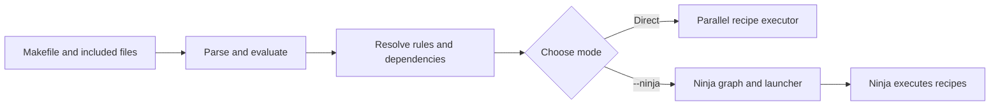

# GNU-free Kati

**Read Makefiles. Build targets directly or generate Ninja. Use a GNU-free toolchain.**

This repository maintains a C++ fork of [Google Kati](https://github.com/google/kati). Its `ckati` executable understands Makefile syntax and supports two workflows: parallel direct execution and Makefile-to-Ninja conversion. The supported platform is Linux with musl; other platforms are best effort.

| Capability | What it does |
| --- | --- |
| Direct builds | Executes requested targets, with independent work running in parallel under `-j`. |
| Ninja conversion | Emits a Ninja graph and a `ninja.sh` launcher from a Makefile. |
| Fast regeneration | `--ninja --regen` checks whether the generated graph needs updating. |
| GNU-free project path | Builds and tests with Ninja, Clang/LLVM, musl, libc++, and POSIX shell tools in Chimera Linux. |

## Quick start

Build on [Chimera Linux](https://chimera-linux.org/about/) with `clang`, `ninja`, `python`, and `chimerautils` installed:

```sh
ninja -f build.ninja -j4 ckati
```

Run the following example **in a separate directory**. Conversion writes a `build.ninja` file, so running it in the repository root would replace the project's own build file.

```sh
mkdir demo
cd demo
cat > Makefile <<'EOF'
.PHONY: all
all: hello.txt

hello.txt:
	printf 'hello from ckati\n' > $@
EOF

# Execute the Makefile directly.
../ckati -f Makefile -j4 all

# Generate a Ninja graph, then use its generated launcher.
../ckati --ninja --regen -f Makefile all
sh ./ninja.sh -j4
```

`ninja.sh` is generated by `ckati`; it is not a checked-in script. The second build above should find `hello.txt` up to date. After changing the Makefile, rerun `ckati --ninja --regen` before using the generated Ninja graph.

For a full clean build and test run in the supported environment:

```sh
docker build -t kati-test .
docker run --rm kati-test
```

The Docker image uses Chimera Linux and runs the C++ unit binaries, regression suite, and converted shell tests. The CI workflow builds and tests that same image.

## How it works



The C++ code is organized around that path:

| Stage | Main files | Responsibility |
| --- | --- | --- |
| Parse | [`parser.cc`](src/parser.cc), [`expr.cc`](src/expr.cc), [`file_cache.cc`](src/file_cache.cc) | Parse statements and expressions; reuse parsed includes. |
| Evaluate | [`eval.cc`](src/eval.cc), [`stmt.cc`](src/stmt.cc), [`func.cc`](src/func.cc) | Expand variables, directives, functions, and rules. |
| Resolve | [`dep.cc`](src/dep.cc) | Build the requested target's dependency graph. |
| Execute | [`command.cc`](src/command.cc), [`exec.cc`](src/exec.cc) | Expand recipes and schedule direct builds. |
| Convert | [`ninja.cc`](src/ninja.cc), [`regen.cc`](src/regen.cc) | Write Ninja files and check whether they need regeneration. |

Both modes use the same parsing and rule resolution. Some Makefile constructs have no exact Ninja equivalent; changes to conversion behavior need coverage in both modes.

## Modes and compatibility

| Behavior | Direct execution | Generated Ninja |
| --- | --- | --- |
| Dependency scheduling | Runs recipes with a bounded `-j` job limit. | Ninja schedules the emitted graph. |
| Makefile changes | Parsed on each invocation. | Rerun `ckati --ninja --regen` before invoking the generated graph. |
| Exported variables | Captured at each recipe boundary. | Captured during graph generation and restored by generated recipes. |
| Recursive builds | Child Kati processes evaluate their own Makefiles. | Recursive commands are opaque Ninja edges and share a Kati jobserver. |
| Dynamic Makefile features | Evaluated by Kati when supported. | Features without an exact Ninja equivalent may be resolved during graph generation. |

Kati implements a subset of GNU Make syntax. The `load` directive for dynamic Make extensions is unsupported. If a Makefile relies on side effects from parse-time `$(shell ...)`, generated graphs need particular care: regeneration rechecks recorded inputs and command results, but Ninja itself does not re-evaluate the Makefile. Prefer direct mode for workflows whose dependencies can change while recipes run.

Common options are `-f FILE` for the Makefile, `-jN` for direct execution concurrency, `-k` to continue after recipe failures, `-n` for a dry run, `-q` to ask whether targets need building, and `-t` to update existing targets without recipes. `--ninja` writes a Ninja graph; add `--regen` to reuse it when its recorded inputs are current. `--ninja_dir DIR` places generated files in another directory. `--version` prints the source revision built into `ckati`; local builds with uncommitted changes have a `+dirty` suffix.

## GNU-free boundary

The supported build and test path is the Chimera Linux environment in [`Dockerfile`](Dockerfile). It uses Clang/LLVM, musl, libc++, Ninja, Python, and POSIX shell tools. The project does not require GNU Make, GCC, glibc, Bash, or GNU utilities to build, test, or run `ckati`. Makefile syntax compatibility is implemented in this project; it does not execute GNU Make.

Recipes and `$(shell ...)` expressions supplied by a **user's Makefile** can invoke any external command the user chooses. That input is outside the project's GNU-free guarantee. Likewise, Docker and the GitHub Actions host are external infrastructure; the build and tests run inside the Chimera image.

`deps = gcc` in [`build.ninja`](build.ninja) is Ninja's name for a compiler depfile format. It does not run GCC.

## Testing and performance

Inside Chimera, run the test binaries and self-contained regression snapshots with:

```sh
ninja -f build.ninja -j4 ckati tests
out/find_test && out/ninja_test && out/strutil_test
python tests/correctness.py
python tests/make_compat_regressions.py
python tests/regression.py
sh testcase/dump/run.sh
```

The snapshot suite covers direct execution, Ninja generation, recursive and parallel builds, and converted POSIX shell tests. It compares against checked-in expected outcomes, without a GNU Make reference executable. Some fixtures intentionally expect a nonzero result. The existing crash cases are listed separately in [`known_crashes.json`](tests/known_crashes.json); recording snapshots rejects new crashes and requires recovered cases to leave that list. Use `python tests/regression.py --case pattern` to inspect matching scenarios. When changing behavior, add or update a fixture in [`testcase/`](testcase/), then run `python tests/regression.py --record` in Chimera and review the resulting snapshot diff.

The focused correctness suite checks incremental rebuilds, failure handling, recipe exports, regeneration, and job limits using output contents and exit codes. The Make compatibility suite checks observed GNU Make behavior for dependency, rule, variable, and restart edge cases, plus OpenWrt image refresh. To run the compiler sanitizers in a separate output directory, use `python tools/gen_sanitizer_build.py`, build `ckati-sanitized tests` with `ninja -f build.sanitizer.ninja`, then set `KATI_BINARY` to the sanitized binary when running `tests/correctness.py` and `tests/make_compat_regressions.py`. The CI image runs these checks on musl.

To measure conversion, no-op regeneration, parallel execution, peak memory, and binary size:

```sh
python tests/bench.py ./ckati
python tests/bench.py ./ckati --baseline /path/to/baseline/ckati
```

The benchmark covers conversion, no-op regeneration, flat and nested parallel execution, incremental no-op builds, peak memory, and binary size. Build both binaries with the same toolchain for a useful comparison. [PR #1](https://github.com/RihardsPaps/UNIVERSAL_GNUMAKE_TO_NINJA_TOOL/pull/1) records the original C++ comparison, test results, and GNU dependency audit. On those fixed workloads, the refactor showed no material runtime or peak-memory regression and reduced the binary from 894,896 to 836,960 bytes.

## Contributing

Open issues and pull requests in [this repository](https://github.com/RihardsPaps/UNIVERSAL_GNUMAKE_TO_NINJA_TOOL). Keep the project-controlled build, tests, CI image, and runtime free of GNU dependencies. Preserve existing copyright and license notices in source files. For behavior changes, include a regression fixture; for performance changes, include same-toolchain benchmark results. Run the Chimera test image before submitting a pull request.

## Credits and license

**Current project:** [Rihards Paps](https://github.com/RihardsPaps) designed the GNU-free direction, owns the repository, and maintains the fork. [Haralds Paps](https://github.com/HarryMidnight) is a contributor. Rihards is listed in [`CODEOWNERS`](CODEOWNERS).

**Source project:** This work derives from [Google Kati](https://github.com/google/kati). The original copyright author record names Delilah Hoare, Google Inc., Koichi Shiraishi, Kouhei Sutou, and Po Hu. Historical contributor credit is retained below. This project preserves upstream source notices and the [Apache License 2.0](LICENSE); the credits here do not change copyright ownership.

<details>
<summary>Historical upstream contributors</summary>

Colin Cross · Dan Willemsen · Delilah Hoare · Fumitoshi Ukai · Koichi Shiraishi · Kouhei Sutou · Po Hu · Ryo Hashimoto · Shinichiro Hamaji · Stefan Becker · Steve McKay · Taiju Tsuiki

</details>
