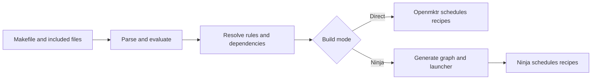

> FORK MODIFICATION NOTICE (2026)
> Changed by the Openmktr fork, maintained by Rihards Paps and
> Haralds Paps. Rewritten and expanded the fork's overview, build instructions,
> usage examples, architecture, compatibility guidance, and troubleshooting.
> Upstream material retains its Apache-2.0 terms. Fork modifications are
> covered by Mozilla Public License 2.0; see docs/LICENSING.md and NOTICE
> at the repository root. Original notices below remain applicable.

# Openmktr

**Read Makefiles. Build targets in parallel. Generate Ninja graphs.**

Openmktr (Open Make Translator) is a C++17 fork of
[Google Kati](https://github.com/google/kati).
Its `omktr` executable parses and evaluates Makefiles, resolves dependencies,
and either runs recipes directly or writes a build graph for Ninja to execute.
Both workflows start with your existing Makefile.

The supported platform is **Linux with musl**, using Clang/LLVM and libc++.
[Chimera Linux](https://chimera-linux.org/about/) supplies the repository's
build and test environment. Other platforms are best effort.

| Capability | What you can do |
| --- | --- |
| Direct execution | Build requested Makefile targets with parallel recipe scheduling. |
| Ninja generation | Turn evaluated Makefile rules into a Ninja graph and generated launcher. |
| Regeneration checks | Reuse a generated graph when its recorded inputs remain current. |
| Recursive builds | Run child Openmktr builds with shared job limits. |
| GNU-free project toolchain | Build, test, and run Openmktr with LLVM, musl, libc++, Ninja, Python, and POSIX shell tools. |

Openmktr implements a subset of GNU Make syntax. Compatibility depends on the
Makefile and the selected build mode; see [compatibility](#compatibility-and-scope)
before adopting it for an existing project.

## Contents

- [Build Openmktr](#build-openmktr)
- [Try it in five steps](#try-it-in-five-steps)
- [Choose a build mode](#choose-a-build-mode)
- [Everyday usage](#everyday-usage)
- [How it works](#how-it-works)
- [Compatibility and scope](#compatibility-and-scope)
- [Validation and performance](#validation-and-performance)
- [Troubleshooting](#troubleshooting)
- [Contributing and documentation](#contributing-and-documentation)
- [Maintainers, credits, and licensing](#maintainers-credits-and-licensing)

## Build Openmktr

### On Chimera Linux

Install the supported packages, then build from the repository root:

```sh
apk add clang ninja python chimerautils
ninja -f build.ninja -j4 omktr
./omktr --version
```

Installing packages requires the appropriate system privileges. The executable
is written to `./omktr`; intermediate build files go into `out/`.

The checked-in [build graph](build.ninja) uses C++17, Clang++, libc++, LLVM's
lld linker, and ThinLTO. Ninja's `deps = gcc` setting names a compiler depfile
format; it does not invoke GCC.

### Build and test in a container

With Docker available, run these commands from the repository root:

```sh
docker build -t openmktr-test .
docker run --rm openmktr-test
```

The [Dockerfile](Dockerfile) uses a pinned Chimera image, builds `omktr` and the
C++ test binaries, checks for unwanted GNU dependencies, and runs the standard
suites when the container starts. The executable stays inside the image; this
workflow does not install it on the host.

Docker and the CI host are external infrastructure. The project-controlled
build and tests execute inside Chimera.

## Try it in five steps

After building `omktr`, start in the repository root and run the five steps
below in the same POSIX shell. The example creates a disposable workspace so
conversion cannot replace the repository's own build graph.

**1. Save the executable path and enter a temporary directory.**

```sh
omktr_binary="$(pwd)/omktr"
demo_dir="$(mktemp -d)"
cd "$demo_dir"
```

**2. Create a small Makefile.** The recipe line begins with a literal tab.

```sh
cat > Makefile <<'EOF'
.PHONY: all
all: hello.txt

hello.txt:
	printf 'hello from omktr\n' > $@
EOF
```

**3. Build the target directly.**

```sh
"$omktr_binary" -f Makefile -j4 all
cat hello.txt
```

The file contains `hello from omktr`.

**4. Remove the result and build it through Ninja.**

```sh
rm hello.txt
"$omktr_binary" --ninja --regen -f Makefile all
sh ./ninja.sh -j4
cat hello.txt
```

You get the same file through the generated graph.

**5. Run the launcher again.**

```sh
sh ./ninja.sh -j4
```

Ninja should report that there is no work to do. The demo remains in
`$demo_dir` for inspection.

> **Conversion writes `build.ninja` by default.** Run conversion examples in a
> disposable directory. Running them at this repository's root can overwrite
> the checked-in graph used to build Openmktr itself.

## Choose a build mode

| Behavior | Direct execution | Generated Ninja |
| --- | --- | --- |
| Invocation | `omktr -f Makefile -j4 all` | `omktr --ninja --regen -f Makefile all`, then `sh ninja.sh -j4` |
| Makefile evaluation | Reads and evaluates Makefiles on each invocation. | Evaluates Makefiles when generating the graph. |
| Recipe scheduling | Openmktr schedules work under its job limit. | Ninja schedules the generated edges. |
| Exported variables | Captured at recipe boundaries. | Recorded during generation and restored by generated recipes. |
| Recursive builds | Child Openmktr processes read their own Makefiles. | Recursive commands remain recipes; child graphs are not flattened into the parent graph. |
| Input changes | Handled on the next Openmktr invocation. | Check regeneration with Openmktr before running the graph. |

Use direct execution to start evaluating an existing project, especially when
its dependencies can change while recipes run. Use Ninja generation when the
evaluated dependency graph suits your workflow and you want Ninja to schedule
subsequent builds.

### Keep a generated graph current

Treat generation and execution as two separate steps. Before a Ninja build,
rerun the same generation command, including its targets and variable
assignments:

```sh
omktr --ninja --regen -j8 -f Makefile all MODE=release
sh ./ninja.sh -j2
```

`--regen` checks recorded inputs and command results, reusing the graph when
they are current. Standard-input Makefiles always regenerate. Ninja itself
does not re-evaluate Makefiles.

Use the generated `ninja.sh` launcher to load the recorded environment and
coordinate job limits with recursive Openmktr builds. Set runtime concurrency on
that launcher; its `-j` value is independent of the generation-time `-j` value.
For example, you can generate with `-j8` and build with `-j2`, or use a higher
Ninja job count than the one used for generation. Run the launcher from the same
working directory used for generation.

## Everyday usage

These examples assume `omktr` is on your `PATH` and you are in the project you
want to build. Otherwise, use the executable's absolute path.

```sh
# Build a named target with four jobs.
omktr -f Makefile -j4 all

# Supply a command-line variable assignment.
omktr -f Makefile -j4 all MODE=release

# Build in a different working directory.
omktr -C path/to/project -f Makefile -j4 all

# Inspect the recipes for a direct build.
omktr -n -f Makefile all

# Generate files in a separate directory, then run the launcher.
omktr --ninja --regen --ninja_dir .kati -f Makefile all
sh ./.kati/ninja.sh -j4
```

`--ninja_dir` changes where generated files are written. It does not change
the working directory for the build's recipes.

### Common options

| Option | Purpose |
| --- | --- |
| `-f FILE` | Read a Makefile; `-f -` reads standard input. |
| `-C DIR` | Change the working directory before processing the build. |
| `-jN` | Set direct execution concurrency. For Ninja builds, pass `-jN` to the launcher. |
| `-k` | Continue independent work after recipe failures. |
| `-n` | Print ordinary recipes without executing them. Recursive Make commands and recipes marked `+` can still run. |
| `-q` | Check whether targets need building. |
| `-t` | Update target timestamps instead of running ordinary recipes. |
| `--ninja` | Generate a Ninja graph, environment script, and launcher. |
| `--regen` | Check recorded inputs before reusing a generated graph. |
| `--regen_debug` | Enable diagnostics for regeneration checks. |
| `--ninja_dir DIR` | Write generated files into the specified directory. |
| `--version` | Print a Make compatibility banner and the Openmktr source revision. |

### Identify the binary

Git builds include the source revision and a `+dirty` suffix when the checkout
has uncommitted changes. `OMKTR_SOURCE_REVISION` can supply an explicit build
revision; source archives without Git metadata or an explicit revision report
`unversioned`.

The `GNU Make 4.2.1` line in `--version` is a compatibility banner. The following
`omktr` line identifies the Openmktr build; the banner does not establish complete
GNU Make compatibility.

## How it works

Both modes share the same parser, evaluator, and dependency resolver. The
execution path branches after Openmktr has interpreted the Makefile's rules.



| Stage | Main implementation |
| --- | --- |
| Parse statements and expressions | [parser.cc](src/parser.cc), [expr.cc](src/expr.cc) |
| Cache parsed includes | [file_cache.cc](src/file_cache.cc) |
| Evaluate variables, directives, functions, and rules | [eval.cc](src/eval.cc), [stmt.cc](src/stmt.cc), [func.cc](src/func.cc) |
| Resolve rules and dependencies | [dep.cc](src/dep.cc) |
| Expand recipes and execute direct builds | [command.cc](src/command.cc), [exec.cc](src/exec.cc) |
| Generate Ninja files and check regeneration | [ninja.cc](src/ninja.cc), [regen.cc](src/regen.cc) |

Recursive recipes using `$(MAKE)` invoke Openmktr through its executable path.
Child builds evaluate their own Makefiles at execution time. In Ninja mode,
the generated launcher supplies the shared Openmktr jobserver for those children.

## Compatibility and scope

### Makefile support

Openmktr supports a subset of GNU Make syntax and behavior. The dynamic-extension
`load` directive is unsupported, and BSD Make dialect support is incomplete.
Some dynamic Makefile features have no exact Ninja equivalent.

Pay particular attention to parse-time `$(shell ...)` expressions when
converting a build: evaluation and regeneration checks can run shell commands
before Ninja executes any recipes. Check their side effects and verify both
the first build and subsequent incremental builds.

### The GNU-free boundary

The project-controlled build, tests, and runtime use Clang/LLVM, musl, libc++,
Ninja, Python, and POSIX shell tools. They do not require GNU Make, GCC, glibc,
Bash, or GNU utilities. Openmktr implements Makefile compatibility itself.

Commands in user-supplied recipes and `$(shell ...)` expressions can invoke
other tools. Those commands are outside this guarantee, as are external
campaign infrastructure and third-party build requirements. Converting a
Makefile does not replace the tools that its recipes call.

### Recorded compatibility evidence

See the [campaign results](validation/PROGRESS.md) for verified builds of
selected, pinned releases and configurations, together with skips, unresolved
gaps, and coverage limits. The matrix records the results for those specific
runs; it does not establish compatibility for every version or target.

All build configurations currently marked PASS in the campaign matrix have
been verified to build successfully. The most recent end-to-end check built
FFmpeg 9.0.2 through Ninja, completing all 2,677 steps; the resulting
executable passed a short audio/video encode and decode smoke check.

Read the [campaign guide](validation/README.md) before using its tools or
citing a result. The helpers target a specific recorded environment and do
not replace the portable CI checks.

## Validation and performance

The portable pull-request gate is defined in
[cpp-ci.yml](.github/workflows/cpp-ci.yml). It builds and tests the Chimera
image, checks changed C++ formatting, and runs a separate sanitizer build.

Inside Chimera, run the standard checks with:

```sh
ninja -f build.ninja -j4 omktr tests
out/find_test && out/ninja_test && out/strutil_test
python tests/version_generator.py
python tests/correctness.py
python tests/make_compat_regressions.py
python tests/regression.py
sh testcase/dump/run.sh
```

The suites cover C++ helpers, revision generation, incremental builds,
failures, exports, regeneration, dependency and variable semantics, recursive
builds, and parallel execution. They use self-contained expectations and
checked-in snapshots, without requiring a GNU Make reference executable.
Some fixtures intentionally expect a nonzero exit status.

For a focused snapshot run:

```sh
python tests/regression.py --case automake_stdin_recursive
```

To measure conversion, regeneration, direct execution, peak memory, and binary
size, build baseline and candidate binaries with the same toolchain and run:

```sh
python tests/bench.py ./omktr
python tests/bench.py ./omktr --baseline /path/to/baseline/omktr
```

See [CONTRIBUTING.md](CONTRIBUTING.md) for formatting checks, snapshot updates,
sanitizer commands, and benchmark guidance.

## Troubleshooting

| Symptom | What to check |
| --- | --- |
| The native build cannot find libc++ or lld. | Use the supported Chimera packages or the container workflow. Other platforms are best effort. |
| Ninja uses an old rule or variable value. | Rerun the generation command with `--regen`, preserving targets and variable assignments, before invoking the launcher. |
| Recursive Ninja builds have unexpected environment or concurrency behavior. | Use the generated `ninja.sh` launcher and set its runtime `-j` limit. |
| A recursive edge fails without an obvious cause. | Inspect the child command's output and exit status; the parent edge names the failed recipe. See the [recursive-build diagnosis guide](validation/README.md#diagnose-recursive-ninja-failures). |
| Shell commands run during conversion. | Check parse-time `$(shell ...)` expressions and regeneration checks. |
| A Makefile fails on BSD directives or `load`. | Check the syntax limits above; changing the scheduler does not add support for those constructs. |
| A project still invokes GNU tools after conversion. | Inspect its recipes and shell expressions. Those commands retain their external tool requirements. |

## Contributing and documentation

Open issues and pull requests in the
[project repository](https://github.com/RihardsPaps/Openmktr).
For a useful bug report, include a minimal Makefile, the command, `omktr --version` output, platform, expected result, and actual output. For Ninja
issues, include both the generation command and the launcher command.

For code changes, keep fixes focused and add a regression test. Changes to
shared semantics need coverage in both direct and Ninja modes. Preserve the
GNU-free toolchain and all applicable copyright and license notices.

| Guide | What you will find |
| --- | --- |
| [Contributing](CONTRIBUTING.md) | Validation commands, fixtures, formatting, sanitizers, benchmarks, and source layout. |
| [Compatibility validation](validation/README.md) | Campaign workflow, evidence requirements, and recursive-build diagnosis. |
| [Campaign results](validation/PROGRESS.md) | Recorded configurations, outcomes, and known limits. |
| [Licensing and provenance](docs/LICENSING.md) | License scope, attribution, contributions, and redistribution requirements. |
| [Agent guidance](AGENTS.md) | Repository rules and the GitHub issue workflow for automated agents. |

## Maintainers, credits, and licensing

[Rihards Paps](https://github.com/RihardsPaps) designed the GNU-free direction.
Rihards and [Haralds Paps](https://github.com/HarryMidnight) jointly own the
repository and maintain the fork.

This project derives from [Google Kati](https://github.com/google/kati). The
original upstream [author record](LICENSES/upstream-AUTHORS.txt) and
[contributor record](LICENSES/upstream-CONTRIBUTORS.txt) are preserved alongside
existing source notices.

The fork is licensed under the **[Mozilla Public License 2.0 (MPL 2.0)](LICENSE)**.
Original upstream material retains its [Apache License 2.0](LICENSES/Apache-2.0.txt)
terms and existing rights. See
[licensing and provenance](docs/LICENSING.md) and [NOTICE](NOTICE) for the scope
of each license and the notices required for redistribution.

Original fork contributions use Mozilla Public License 2.0 unless different
terms are explicitly identified and accepted. Preserve upstream notices and
identify changes to upstream-derived files as described in the licensing guide.

An **Apache License 2.0 option is available by negotiation**. Interested parties
can email [rihardspaps6@gmail.com](mailto:rihardspaps6@gmail.com). The Apache
option for fork contributions requires a separate agreement; it is not an
automatic alternative to MPL 2.0.
